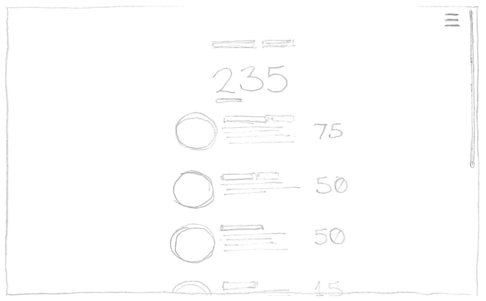

# Offline Achievements

## Elevator Pitch

If you're a gamer, you're probably familiar with Xbox Achievements or PlayStation Trophies: small supplementary challenges for players to take on as they enjoy playing a game. When one of these challenges is completed, the player receives an award that can be shown off to their friends. But what about when you're not playing games? What about fun supplementary challenges for real life? **Offline Achievements** enables friends to compete for bragging rights by completing real-world tasks as simple as "high-five a stranger" or as complex as "learn how to juggle." The point value for each challenge reflects its complexity.

## Key Features

The user will be able to:
- Sign up for an account and securely log in with a username and password
- View completed challenges
- Mark uncompleted challenges as complete
- Search for another user and view their completed challenges
- View a leaderboard of who has the highest score

## Technology Use

The following technologies will be used:

- **HTML** - Provides the structure of the application. Four pages total: login/signup, user profile, leaderboard, search results
- **CSS** - Adds styling to the pages, as well as resizeability functionality
- **JavaScript** - Performs login/signup logic, applies marking-off of achievements, makes backend endpoint calls
- **Services** - Backend service endpoints for:
    - Login/signup
    - Updating the user's completed achievements
    - Totaling the user's achievement score
    - Retrieving a list of user profiles, ordered by their achievement scores
    - Retrieving a list of completed achievements from another user
- **DB** - Holds user profile data, including usernames, passwords and achievements
- **Authentication** - Registers and logs in users over HTTPS, gives them access to the ability to mark off achievements
- **WebSocket** - When a user marks off an achievement, it is updated in real time for all users

## Design

### Login Page

On this page a user may login or signup for an account.

### Personal User Profile Page

On this page a user sees a total of the points they've earned through completing achievements and a list of all available achievements. They can also mark achievements as completed.

### Leaderboard and Search Page

On this page a user may view a list of the top scoring users on the platform, select one of the users to view their profile, or search for a specific user.

### User Profile Preview Page

On this page a user may view another user's profile, including a total of the points they've earned and a list of the achievements they've completed.